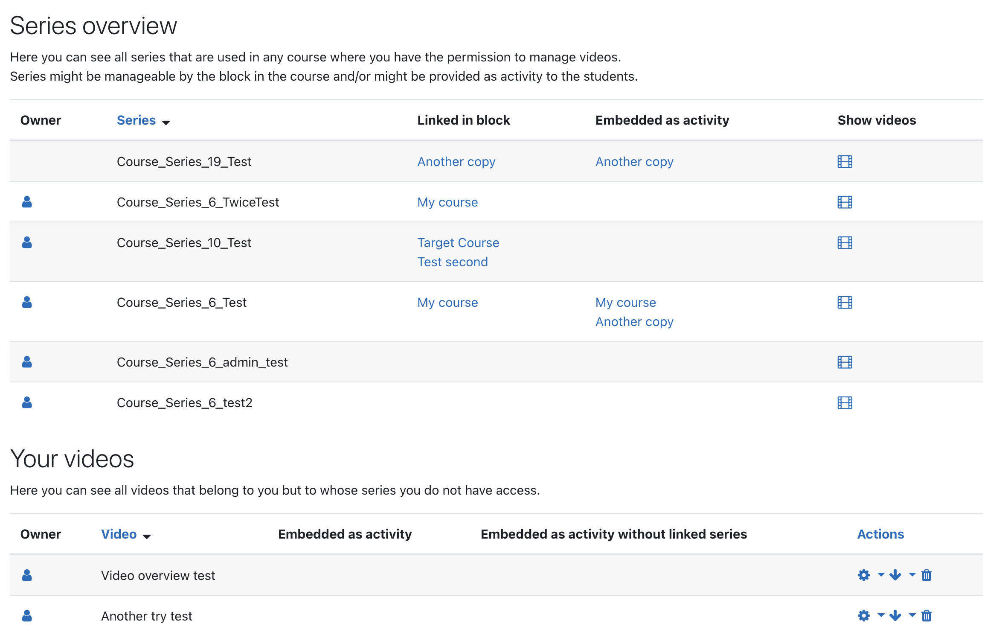

# Global overview
The Opencast block allows teachers to manage their series and videos in a single place. 
If the block is added to the Dashboard page of a user, the user can see a list of all series he has read access to.
For each series, it is shown in which course it is used and which `mod_opencast` activities are associated with it.
The user can also inspect which videos are contained in a series and manage them.
Furthermore, new videos can be added to a series.

## Owner concept
If enabled, series and videos can be owned by user by setting user-specific ACLs. Owning a series/video allows the user to always manage it in the global overview. 
The series/videos are even shown if there are not used in any Moodle course. The ownership can be transferred to another user.