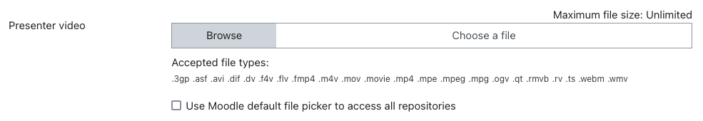

# Opencast chunkupload plugin

The _Chunkupload_ plugin enables users to upload video files to Opencast in smaller, manageable chunks. This approach bypasses the Moodle course upload size limit, allowing users to successfully upload large files without interruptions or failures due to size restrictions.

## Installation

The Opencast Chunkupload plugin can be obtained from the following sources:

- The [GitHub repository](https://github.com/Opencast-Moodle/moodle-local_chunkupload/releases), which provides the latest releases, source code, Roadmap and current developments.

- The [Moodle plugins directory](https://moodle.org/plugins/local_chunkupload), offering a convenient "Official" installation package directly within Moodle.

## Requirements

To ensure the proper functioning of the Opencast Chunkupload plugin, the following requirements must be met:

- **Minimum Moodle Version:** _3.7_
- **[Opencast Videos block (block_opencast)](https://github.com/Opencast-Moodle/moodle-block_opencast):**
  This plugin must be installed and properly configured to enable chunked video uploads.

## Configuration

For detailed configuration instructions, refer to the [settings page](settings.md).

## Chunkupload in Action

Once the plugin is installed and correctly configured, users will see a new chunked file uploader element available exclusively on the **"Add video"** page. The uploader interface appears as shown below:

