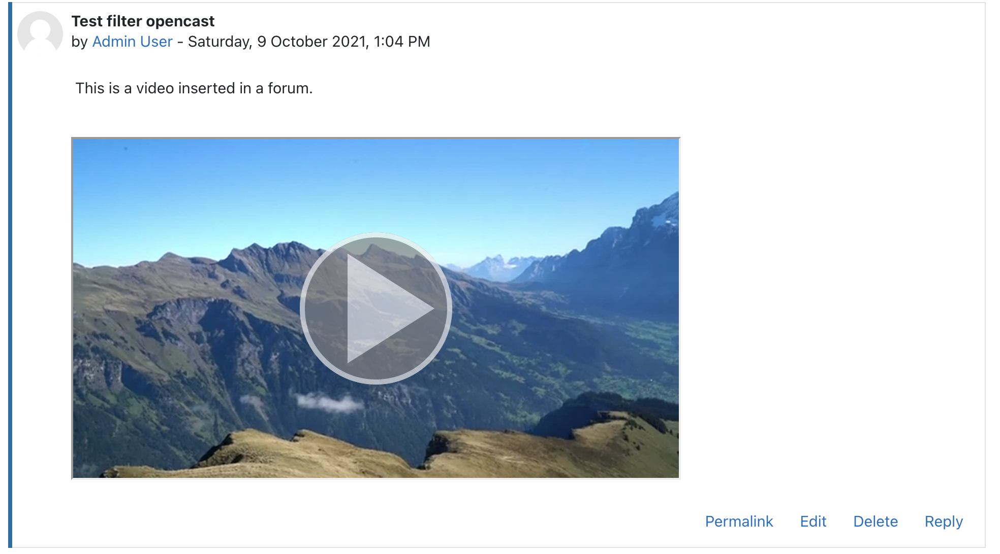

# Opencast filter plugin
The *Opencast filter* can be used, to embed Opencast videos.
The filter takes the HTML pasted by the *Opencast repository* and replaces it by an *iframe*, which loads the [Paella Player](https://paellaplayer.upv.es/) with the respective Opencast event.
The filter itself has no influence on the embedded content, but simply takes the information created by the repository.
Look into the documentation of [Repository_opencast](https://github.com/Opencast-Moodle/moodle-repository_opencast) for details on that.

## Installation
The Opencast filter plugin is available from [GitHub](https://github.com/Opencast-Moodle/moodle-filter_opencast/releases)  as well as from the [Moodle plugins directory](https://moodle.org/plugins/filter_opencast).

## Requirements
- [tool_opencast](https://github.com/Opencast-Moodle/moodle-tool_opencast)
- [mod_opencast](https://github.com/Opencast-Moodle/moodle-mod_opencast)
- [repository_opencast](https://github.com/Opencast-Moodle/moodle-repository_opencast): The filter can be installed without the repository,
  but it is necessary, to allow teachers, to insert Opencast videos.

## Configuration
The configuration of the *Opencast filter* is documented in the [settings](settings.md) page.