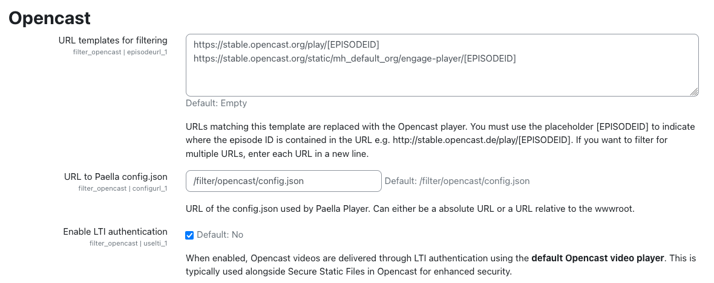

# Settings

The plugin provides the following configuration options:

- **URL templates for filtering:** Defines the URL patterns that will be replaced with the Opencast player.

      * To determine the correct URL, check which URL is inserted into the text by the repository.
      * Typically, only one URL needs to be defined.
      * Use the placeholder `\[EPISODEID]` in the URL to indicate where the episode ID should be inserted, e.g., `http://stable.opencast.de/play/[EPISODEID]`.

- **URL to Paella `config.json`:** Specifies an absolute or relative URL to the `config.json` file used by the Paella Player.

      * This configuration file can be customized to modify the appearance or behavior of the Paella Player.

- **Enable LTI authentication:** Enables authentication to ensure videos are displayed correctly when Opencast is behind the *Secure Static Files* security layer.

      * When enabled, videos will be displayed in the default Opencast video player.
      * It uses the LTI Credentials configured in Opencast API (tool_opencast) plugin.
      * **Important Note**: As mentioned in the _Opencast API (tool_opencast)_ plugin [settings](../tool/settings.md), if you plan to use the LTI Authentication feature and have a multi-node Opencast instance, you must add an additional role (`ROLE_UI_EVENTS_EMBEDDING_CODE_VIEW`) to the Opencast API user's roles to ensure proper functionality.

**NOTE**: After configuring this plugin, you must activate it in the filters.
