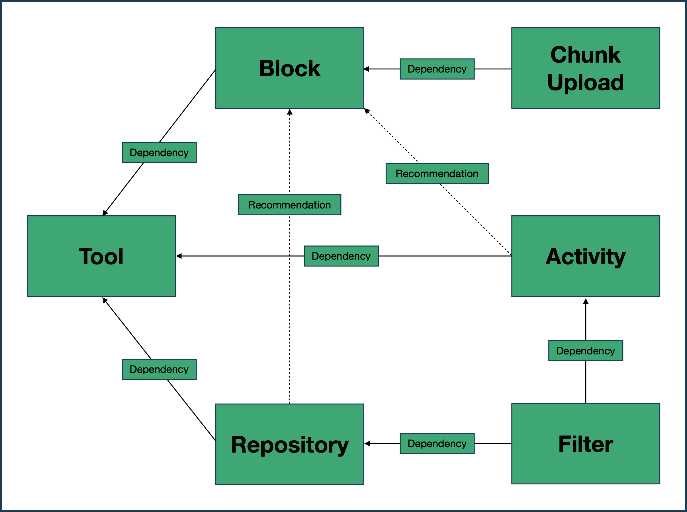

# Opencast Moodle plugins guide

Welcome to the documentation of the Opencast Moodle plugins.

## Plugins

Currently there are five Opencast Moodle plugins. These are:

* **[Tool](tool/about.md):** This is the base plugin that is needed by all other plugins to connect to the Opencast external API.
* **[Block](block/about.md):** This plugin provides a block that can be used to upload videos and manage these from within a Moodle course.
* **[Chunk Upload](chunkupload/about.md):** This plugins provides the possibility of using a chunked upload in the block.
* **[Repository](repository/about.md):** This plugin provides a repository for accessing uploaded videos.
* **[Filter](filter/about.md):** This plugin provides a filter that replaces links to Opencast with a player.

