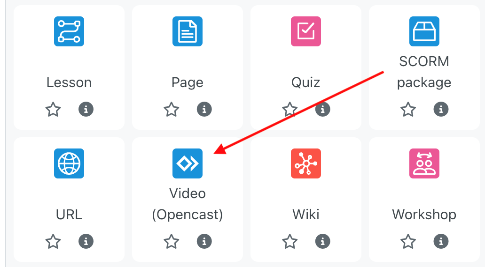
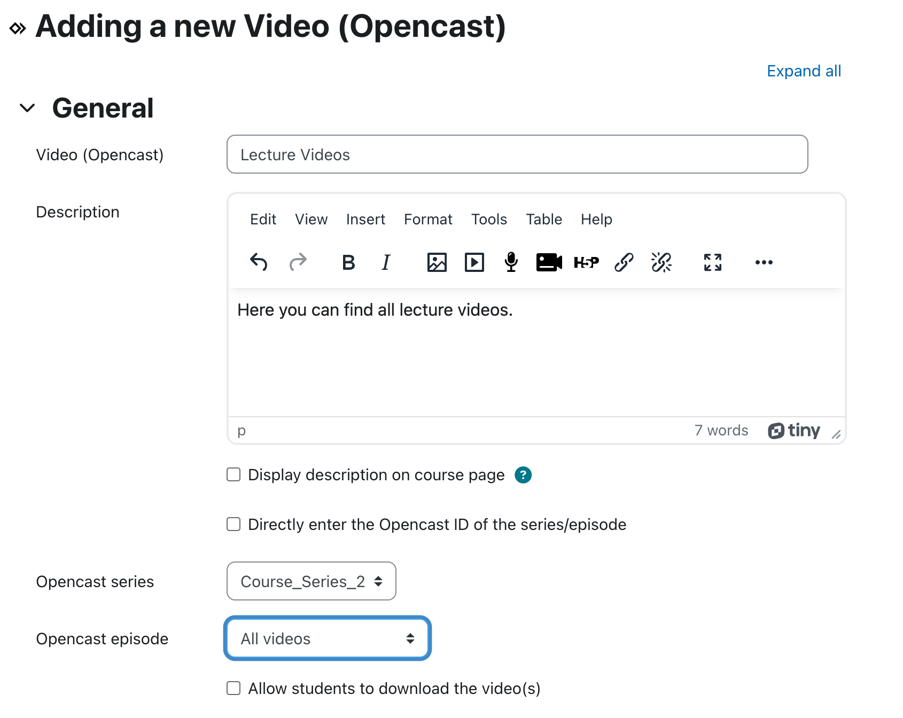
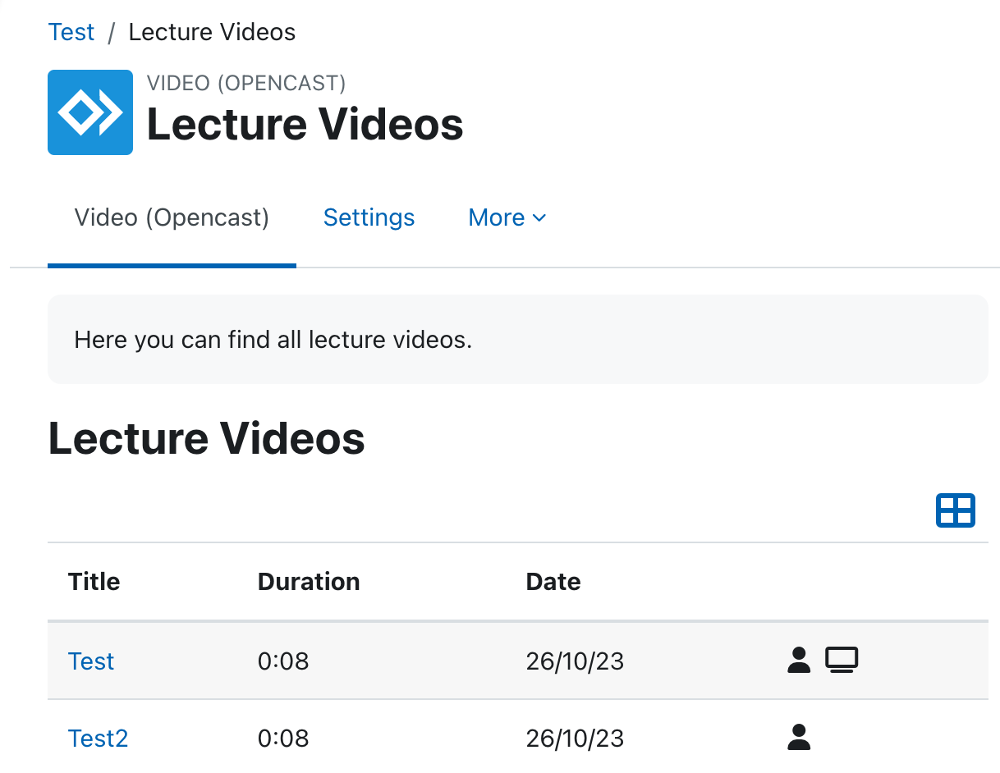
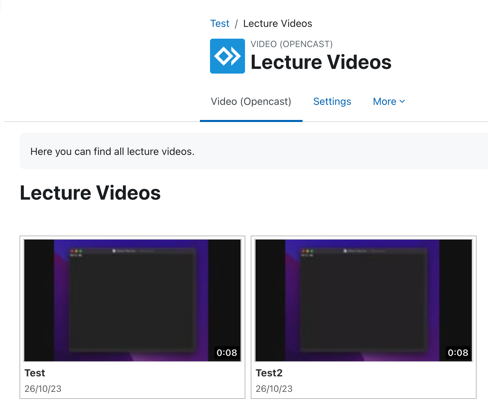
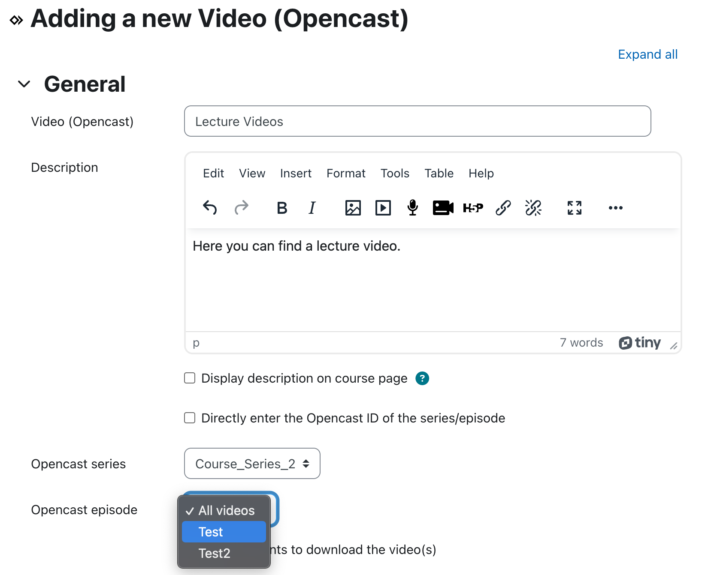
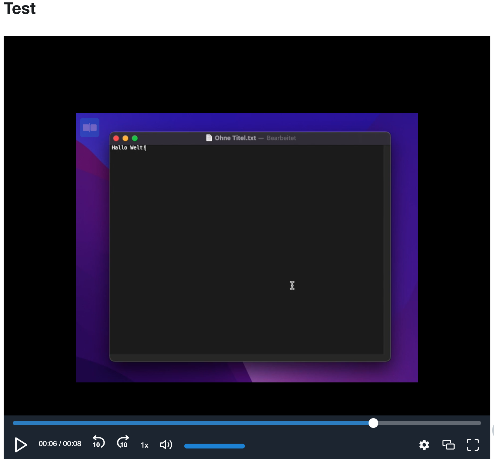

# Opencast activity plugin
This activity can be used, to display and view Opencast episodes and series in Moodle.
Users with respective privileges (in the following called teacher) can select an existing Opencast episode/series and add it to their course. An embedded player allows students, to watch the videos directly in Moodle. As with every activity, the teachers can restrict the access to the videos for students based on e.g. dates, grades or user profiles.
The [Paella player](https://github.com/polimediaupv/paella) is used, to play the videos.

The [Opencast Videos](https://moodle.org/plugins/block_opencast") block also offers the functionality, to add this activity, so that it can be created faster.

## Installation
The Opencast activity plugin is available from [GitHub](https://github.com/Opencast-Moodle/moodle-mod_opencast) as well as from the [Moodle plugins directory](https://moodle.org/plugins/mod_opencast).

## Requirements
- [tool_opencast](https://github.com/Opencast-Moodle/moodle-tool_opencast)
- Recommended: [block_opencast](https://github.com/Opencast-Moodle/moodle-block_opencast)

## Usage scenarios
In the following, the two usage scenarios, providing a series or an episode, are described.

### Use case 1 - Provide a series
The teacher wants to provide a series for students. For example, this series contains all lecture recordings.
1. Add a new "Video (Opencast)" activity.
   
2. Choose the series or enter the Opencast id of the series manually, you want to display:
   
3. If you want, you can specify further configurations like access restrictions.
4. The videos in the series can be either displayed in a list view or in a preview view: 
    
   

### Use case 2 - Provide an episode
The teacher wants to provide a single episode for students. For example, this episode belongs to a specific lecture.
1. Add a new "Video (Opencast)" activity.
   
2. Choose the series or enter the Opencast id of the episode manually, you want to display, as in the previous use case. The activity automatically recognizes, that the entered id is an episode.
   
3. If you want, you can specify further configurations like access restrictions.
4. The activity directly displays a player, that shows the video: 
   

## Configuration
For the configuration of the Opencast activity plugin, see [settings](settings.md).