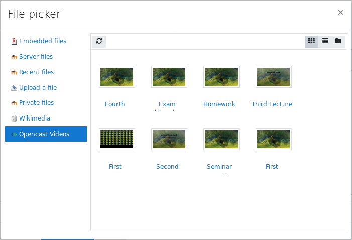

# Opencast repository plugin
The plugin allows teachers, to embed Opencast videos into a course.
The repository displays all videos, that belong to the Opencast series, that are connected to the course. 
The repository is only available within a text editor and will paste the URL to the resource into the content.
This URL will later be replaced via a *Moodle filter*, to show an embedded player. The repository works best in combination with the [Opencast filter](../filter/about.md) plugin. The filter will replace the link with an *iFrame*, which displays the Paella player.

## Installation
The Opencast repository plugin is available from [GitHub](https://github.com/Opencast-Moodle/moodle-repository_opencast) as well as from the [Moodle plugins directory](https://moodle.org/plugins/repository_opencast).

## Requirements
- [tool_opencast](https://github.com/Opencast-Moodle/moodle-tool_opencast)
- Recommended: [block_opencast](https://github.com/Opencast-Moodle/moodle-block_opencast)
- Optional: [filter_opencast](https://github.com/Opencast-Moodle/moodle-filter_opencast)

## Configuration
The configuration of the *Opencast repository* plugin is documented in the [settings](settings.md) page.