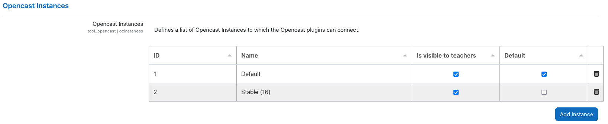
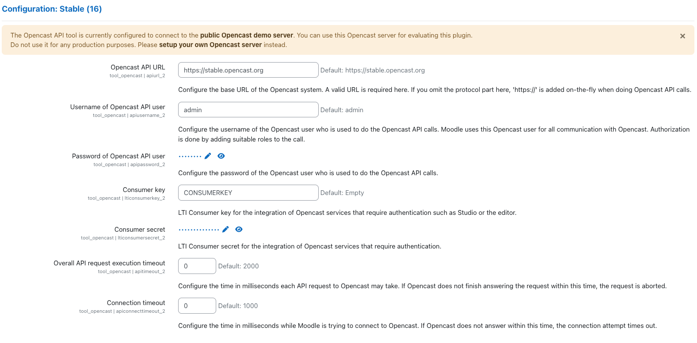
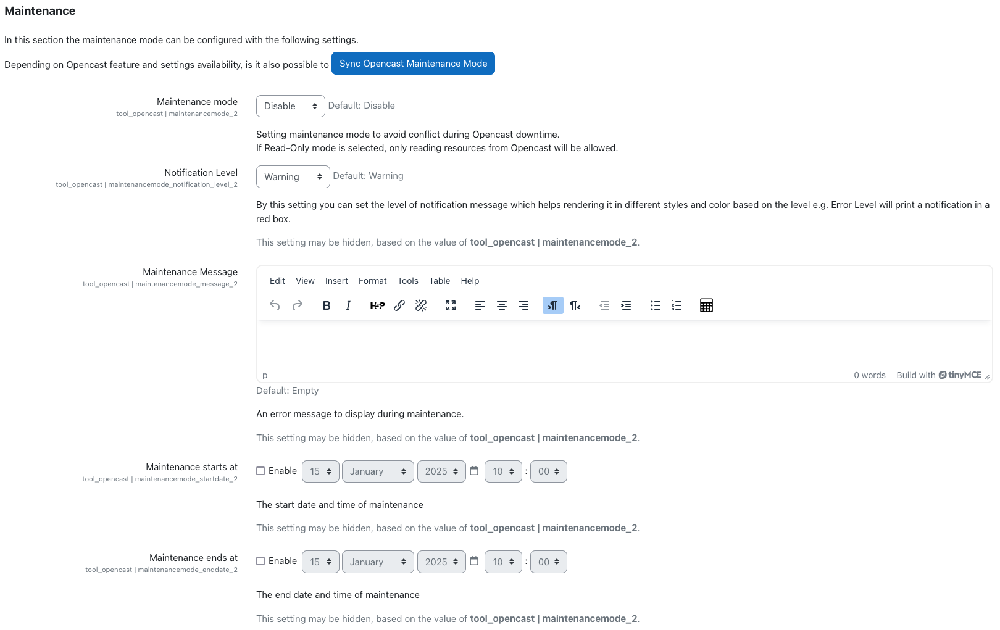
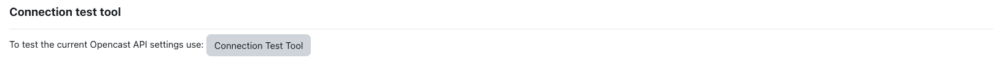

# Settings

The configuration settings of the plugin consist of the following sections:

## Instances

The plugin allows you to connect your Moodle instance to multiple Opencast instances. For each instance, you must configure the settings described below.

The configured instances are listed in the table under **_Opencast Instances_**. You can add new instances by clicking on the **_Add instance_** button.

Each instance is assigned an automatically generated, constant ID. Additionally, you can specify a custom name for each instance. The settings for each instance are displayed in a dedicated (sub-)section, labeled with the instance name.

**NOTE**: The configuration (sub-)section for a newly added instance will be visible only after clicking _Save changes_. The same applies when deleting an instance.

Each instance offers additional configurable options:

- **Is visible to teachers**: If enabled, videos from the corresponding instance are visible in the _Opencast Videos_ block within a course. If disabled, the videos remain hidden.

- **Default**: There must be exactly one default instance. The default instance has the following properties:
  - It is selected automatically in plugins such as Opencast H5P Integration.
  - It takes precedence over other instances in dropdowns to select between instances.
  - It determines the allowed video file extensions for drag-and-drop uploads in course activity sections (with edit mode enabled).

## Prerequisites

Before configuring the Opencast API tool, a user must be created in Opencast with the following roles:

* `ROLE_API`
* `ROLE_API_*`
* `ROLE_SUDO`

Once the user is created, it must be added to the group `Opencast Project External Applications` *(role `ROLE_GROUP_MH_DEFAULT_ORG_EXTERNAL_APPLICATIONS`)* or assigned the necessary API roles by other means.

**NOTE**: The roles listed above are the minimum required; additional roles may be necessary, for example:

* `ROLE_UI_EVENTS_EMBEDDING_CODE_VIEW`: Required for using the Opencast Filter plugin with LTI authentication in a multi-node Opencast instance.
* `ROLE_STUDIO`: Required for access to Opencast Studio.

## Instance Configurations

Each instance has the following configuration options, displayed in a dedicated (sub-)section named after the instance:

* **Opencast API URL:** The base URL of the Opencast system. If you have a multi-node Opencast setup, this should be the URL of the admin server. Provide the URL including `http://` or `https://` (e.g. `https://stable.opencast.org`)

* **Username of API user:** The username of the previously created Opencast user.

* **Password of API user:** The password of the previously created Opencast user.

* **Overall API request execution timeout:**: Timeout (in milliseconds) for API requests to Opencast. Set to "0" for no limit.

* **Connection timeout:** Timeout (in milliseconds) for Moodle to establish a connection with Opencast. Set to "0" for no limit.

If you wish to use LTI for user authentication (e.g., for Opencast Studio or with `Secure Static Files` enabled), configure the following settings:

* **Consumer key:** LTI Consumer key as set in Opencast.

* **Consumer secret:** LTI Consumer secret as set in Opencast.

For LTI configuration details, see [LTI](https://docs.opencast.org/r/16.x/admin/#configuration/ltimodule/#about-lti).

## Maintenance Settings

The maintenance settings section allows you to control access to Opencast during maintenance periods. Options include:

- **Maintenance mode**: Choose between:
  - Disable: No maintenance.
  - Read Only: Access is restricted to reading data only.
  - Enable: Full access restriction.

- **Notification Level**: Define the severity of the maintenance message (Warning, Error, Information, Success).

- **Maintenance Message**: The notification message displayed during maintenance. If empty, a default generic message will be displayed.

- **Maintenance starts at**: The start date/time of maintenance.

- **Maintenance ends at**: The end date/time of maintenance.

**NOTE**: You can synchronize Opencast maintenance settings using the _Sync Opencast Maintenance Mode_ button (feature pending implementation).

## Connection test tool

You can verify your API user configuration by clicking the Connection Test Tool button. This tool checks if Moodle can successfully connect to Opencast and authenticate with the configured API user.

